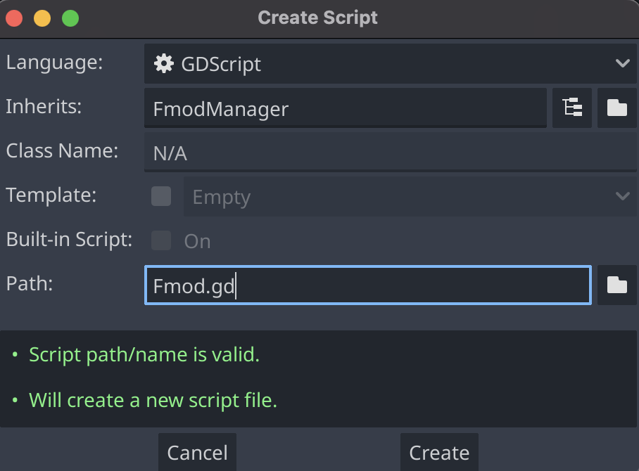
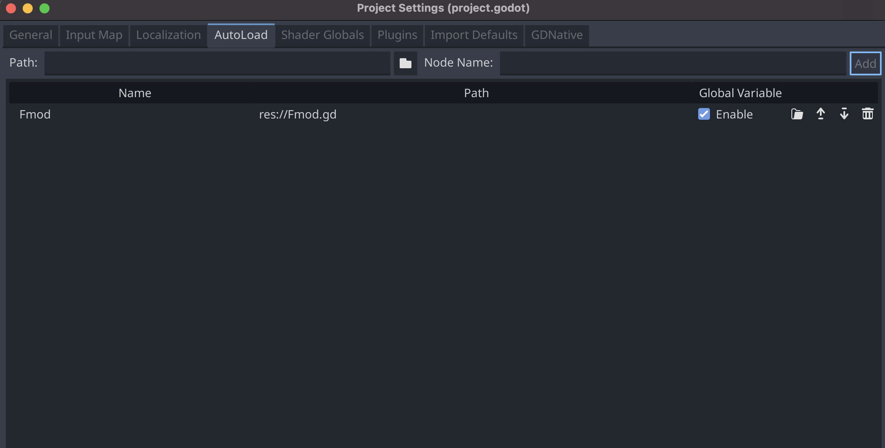

# FMOD GD4
Godot 4 integration of FMOD.

# Installation
1. Clone `godot`: 
> `git clone https://github.com/godotengine/godot`
2. Clone this repository into Godot's `modules/` folder. Rename the repository to `fmod`.
> `cd godot/modules && git clone https://github.com/summertimejordi/fmod_gd4 && mv fmod_gd4 fmod`
3. Download [FMOD Engine](https://www.fmod.com/download#FMOD%20Engine-select)
3. Copy FMOD API folders to the `api` folder in the `fmod` module.
5. [Compile Godot](https://docs.godotengine.org/en/latest/development/compiling/introduction_to_the_buildsystem.html?highlight=compile)

# Usage
1. Create a new script to be used as a singleton

2. Visit `Project Settings->Autoload` and add your new script as a singleton.

3. Now you can access the `FmodManager` through the singleton you provided to get started!